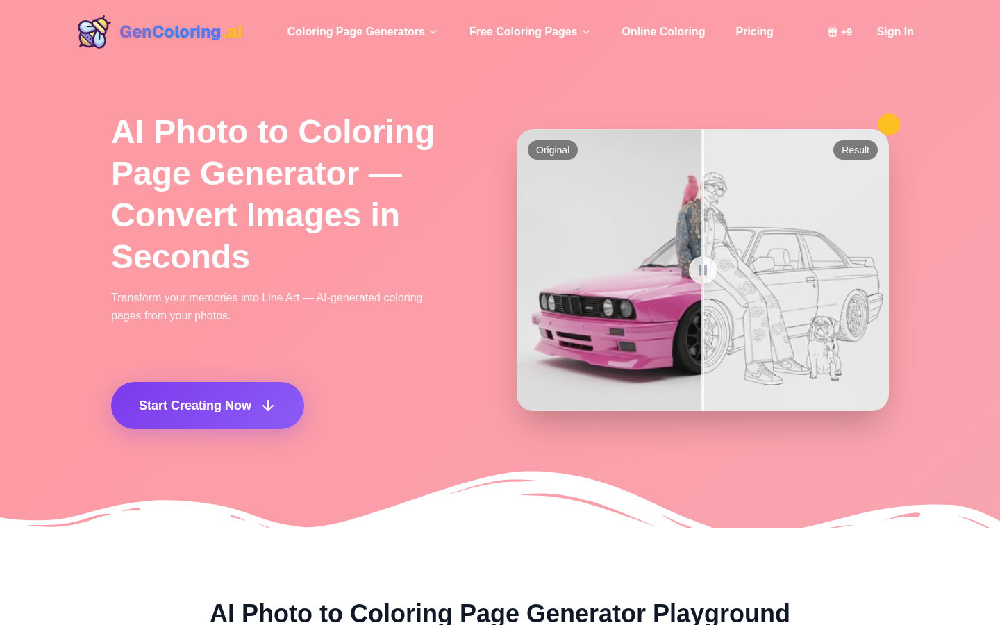
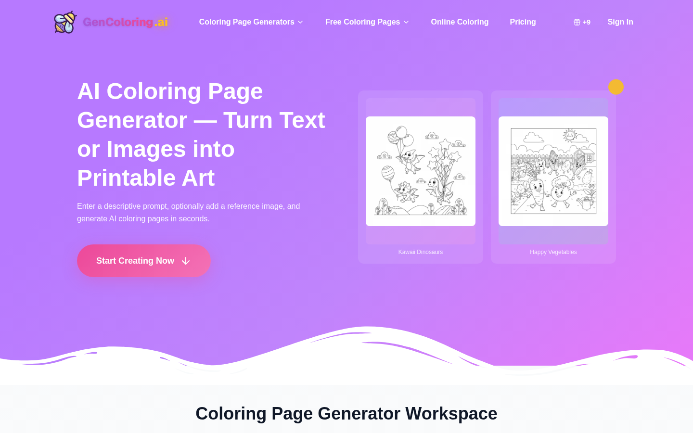
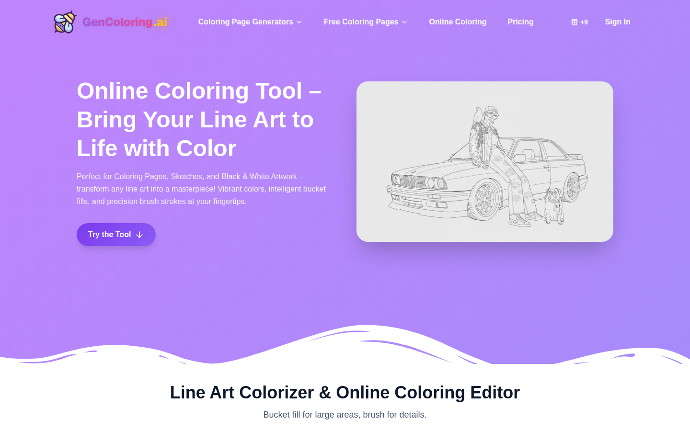

  

# GenColoring AI

Official public repository for [GenColoring AI coloring page generator](https://gencoloring.ai). GenColoring AI turns photos, prompts, and names into printable coloring pages, then lets users print, download, or color line art in the browser.

This repository is the public home for product feedback, issue reports, roadmap notes, support guidance, and community discussion. It does not contain the private production source code for the live website.

## Product Preview

| Coloring page generator | Online coloring editor |
| --- | --- |
|  |  |

## Product Focus

- Parents making printable pages from family photos
- Teachers preparing classroom worksheets and themed activities
- Creators designing name coloring pages for parties, events, and lessons
- Hobbyists who want both printable line art and an online coloring editor

## Main Workflows

- Convert photos into clean printable coloring pages.
- Generate coloring pages from text prompts with optional reference images.
- Create name coloring pages with bubble, geometric, graffiti, rounded, and decorative styles.
- Use the browser coloring editor with fill, brush, palettes, undo, redo, reset, save, and PNG download.
- Browse free themed collections for quick printable discovery.

## What To Open Here

- Photo-to-coloring results that need cleaner line art or better print readability
- Prompt-to-coloring cases for classroom, family, seasonal, or adult coloring use
- Name-page style requests and typography clarity problems
- Online coloring editor behavior, palette usability, download, or print issues

## Repository Boundary

- Public issues and discussions are welcome when they improve the live product experience.
- Do not post private account data, secrets, payment details, uploaded personal media, or sensitive logs.
- Production application code, provider credentials, billing configuration, and deployment secrets are not published here.
- Security reports should follow [SECURITY.md](SECURITY.md) instead of public issues.

## Product Feature Links

- [GenColoring AI coloring page generator](https://gencoloring.ai): Create printable coloring pages from prompts, photos, names, and themed ideas.
- [GenColoring AI coloring page generator page](https://gencoloring.ai/coloring-page-generator): Open the focused generator page for image-to-line-art and printable coloring workflows.

## Choose The Right Feedback Lane

When reporting a coloring result, say whether it began with a photo, a text prompt, a name, or the online coloring editor. That distinction helps maintainers review line-art quality, typography, print readiness, and browser editing as separate workflows.

## Recent Updates

- 2026-07: Reworked README product-entry links so anchor text matches the target page topic and current language.
- 2026-07: Separated repository, feedback, and support routes from product feature links to avoid duplicate product URLs.

## Repository Links

| Destination | Link |
| --- | --- |
| Primary GitHub repository | [GenColoring AI primary GitHub repository](https://github.com/GenColoringAI/gencoloring) |
| Roadmap | [ROADMAP.md](ROADMAP.md) |
| Support | [SUPPORT.md](SUPPORT.md) |
| Security | [SECURITY.md](SECURITY.md) |
